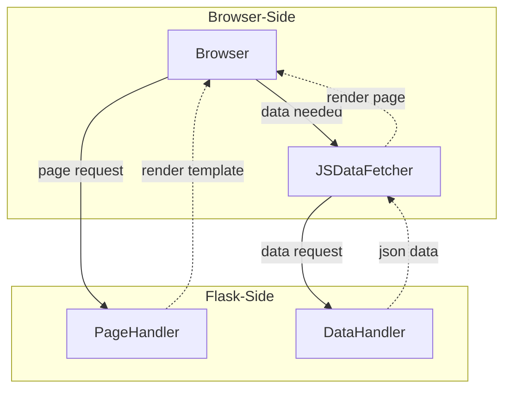

# Lincoln Community Campground Issue Tracker

## Project Overview

The **Lincoln Community Campground Issue Tracker** is a web-based tool designed to streamline issue reporting and management for campground staff and admins. It enables users to create issues and track progress, ensuring efficient operations and a well-maintained environment.

### Key Features

- **User Authentication**: Secure login system with role-based access for visitors, helpers, and admins.
- **Account Management**: everyone can easily visit, update their profile from any pages. 
- **Issue Reporting**: everyone can report issues and track their status.
- **Issue Management**: Helpers and admins can update, comment, and resolve issues.
- **User Management**: Admins can modify user statuses, assign different permission levels, and manage issue updates, comments, and resolutions.

---

## Installation Guide

1. **Clone the repository:**
   ```sh
   git clone https://github.com/Jiajun-Liu-1159501/LCC_Issue_Tracker.git
   cd LCC_Issue_Tracker
   ```
2. **Set up a virtual environment:**
   ```sh
   python3 -m venv .venv
   ```
3. **Activate the virtual environment:**
   ```sh
   source .venv/bin/activate
   ```
4. **Install dependencies:**
   ```sh
   pip install -r requirements.txt
   ```
5. **Set up the database:**
   - Create a database named `lcc`.
   - Run the SQL scripts:
     ```sh
     source create_database.sql
     source populate_database.sql
     ```
6. **Run the web server:**

## User Guide

The system consists of two sliding menus: a left sliding menu and a right sliding menu.
	
   -	**Left Sliding Menu**: Accessed by clicking the hamburger button, it displays the operations permitted for the current user role after logging in.
	
   -	**Right Sliding Menu**: Accessed by clicking the profile avatar, it is only available after the user has logged in and provides options for account management and logging out.

---

## System Architecture

The **LCC Issue Tracker** follows a **front-end & back-end separation** model for better scalability and maintainability.

   - **The Flask back-end** is responsible only for rendering templates without data. It provides data APIs and returns responses in JSON format.
	
   - **The front-end** handles data retrieval, page navigation, and rendering the received data onto the page.
  
